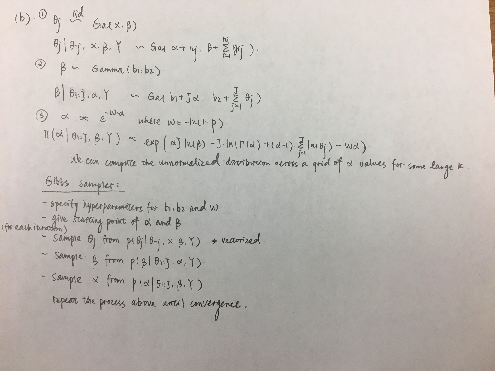

```{r setup, echo = F, message=F, warning=F, include=FALSE}
knitr::opts_chunk$set(echo = TRUE)
library(mvtnorm)
library(MCMCpack)
require(tidyverse)
library(coda)
```

## Question 1:
#### Part (a): Generate predictive samples of $y_{i,1}^{*}$ given $y_{i,2}^{*}$ value you kept, for the 50 test subjects. Show your sampler.
```{r}
# Simulate data: train and test
n_train = 100
n_test = 50
theta = c(0,0)
sigma = matrix(c(1,0.8,0.8,1),nrow=2,ncol=2)
set.seed(1234)
Y_train = rmvnorm(n_train, mean = theta, sigma= sigma)
colnames(Y_train) = c('y1','y2')
set.seed(123)
Y_test = rmvnorm(n_test, mean = theta, sigma= sigma)
Y_test_y2 = Y_test[,2]
colnames(Y_test) = c('y1','y2')
```

```{r}
############################
# Rerun the gibbs sampler from hw5
gibbs_normal = function(mu_0, Lambda_0, nu_0, S_0, n_iter, Y){
  n = nrow(Y)
  ybar = apply(Y,2,mean)
  
  ## Gibbs Sampler
  #Initial values for Gibbs sampler
  Sigma <- cov(Y)
  #Set null matrices to save samples
  THETA <- SIGMA <- NULL
  
  #first set number of iterations and burn-in, then set seed
  burn_in <- 0.3*n_iter
  set.seed(1234)
  
  for (s in 1:(n_iter+burn_in)){
    #update theta using its full conditional
    Lambda_n <- solve(solve(Lambda_0) + n*solve(Sigma))
    mu_n <- Lambda_n %*% (solve(Lambda_0)%*%mu_0 + n*solve(Sigma)%*%ybar)
    theta <- rmvnorm(1,mu_n,Lambda_n)
    #update Sigma
    S_theta <- (t(Y)-c(theta))%*%t(t(Y)-c(theta))
    S_n <- S_0 + S_theta
    nu_n <- nu_0 + n
    Sigma <- riwish(nu_n, S_n)
    #save results only past burn-in
    if(s > burn_in){
      THETA <- rbind(THETA,theta)
      SIGMA <- rbind(SIGMA,c(Sigma))
    }
  } 
  colnames(THETA) <- c("theta_1","theta_2")
  colnames(SIGMA) <- c("sigma_11","sigma_12","sigma_21","sigma_22") #symmetry in sigma
  
  return(list(theta = THETA, sigma = SIGMA))
}

# Initialize the hyperparameters
mu_0 = c(0,0)
Lambda_0 = matrix(c(1,0.5,0.5,1),nrow=2, ncol=2)
nu_0 = 4
S_0 =  matrix(c(1,0,0,1),nrow=2, ncol=2)

# Performs Gibbs Sampling
normal_mcmc = gibbs_normal(mu_0, Lambda_0, nu_0, S_0, n_iter=1000, Y=Y_train)
```

```{r}
gibbs_composition = function(normal_mcmc, Y_test_y2){
  #innitialize values for Gibbs sampler
  Y1 = NULL
  n_iter <- 750; burn_in <- 0.3*n_iter
  set.seed(1234)
  
  for (s in 1:(n_iter+burn_in)){
    #sample theta and sigma from training set
    theta_1 = normal_mcmc$theta[s,][1]
    theta_2 = normal_mcmc$theta[s,][2]
    sigma_11 = normal_mcmc$sigma[s,][1]
    sigma_22 = normal_mcmc$sigma[s,][4]
    sigma_12 = sigma21 = normal_mcmc$sigma[s,][2]
    
    #update y1 which have 50 new predictions
    y1_vec = NULL
    for (y2 in Y_test_y2){
      theta_y1 = theta_1 + sigma_12%*%solve(sigma_22)%*%(y2 - theta_2)
      var_y1 = sigma_11 - sigma_12%*%solve(sigma_22)%*%sigma_12
      y1 = rnorm(1, mean = theta_y1, sd= var_y1)
      y1_vec = rbind(y1_vec, y1)
    }
    
    #save results only past burn-in
    if(s > burn_in){
      Y1 <- cbind(Y1,y1_vec)
    }
  }
  return(Y1)
}

Y1_predict = gibbs_composition(normal_mcmc, Y_test_y2)
```

#### Part (b): Using the samples from the predictive density obtained above, obtain $E[y_{i,1}^{*}|y_{i,2}^{*}]$ for each of the test subjects, as well as a 95% posterior predictive interval. Make a plot containing all the intervals for each of the 50 subjects. In the plot, indicate where each $E[y_{i,1}^{*}|y_{i,2}^{*}]$ falls within each interval.

```{r}
stats = c()
for (i in 1:50 ){
  y1_dist = Y1_predict[i,]
  mean.mc <- mean(y1_dist)
  probs.mc <- quantile(y1_dist, c(0.025,0.975))
  stats = rbind(stats, c(mean.mc, probs.mc))
}
colnames(stats) <- c("mean", "lwr","upr")
stats = data.frame(stats)
gp = 1:50
plot(gp, stats$mean, ylim=c(-3, 3),xlab="y1 index", ylab="y", pch=16, cex=2)
arrows(x0=gp, y0=stats$lwr, x1=gp, y1=stats$upr, code=3, angle=90, length=0.1)
```


#### Part (c): What is the coverage of the 95% predictive intervals out of sample? That is, how many of the 95% predictive intervals contain the true $y_{i,1}^{*}$ values?

```{r}
y1_true = Y_test[,1]
df = cbind(y1_true,stats)

df = as.data.frame(df) # turn it into a dataframe
count_within = df %>% 
  mutate(within = y1_true >= lwr & y1_true <= upr)%>%
  summarise(sum = sum(within))

count_within[1,1]/50
```

42 out of 50 95% predictive intervals contain the true $y_{i,1}$ value. So the coverage is 84%.

#### Part (d): Fit a (frequentist) linear model to the original 100 train subjects, using $y_{i,1}$ as the response variable and $y_{i,2}$ as the predictor. Now use the results from the fitted model to predict $y_{i,1}^{*}$ values given the $y_{i,2}^{*}$ values for 50 new test subjects. Show your R code.

```{r}
Y_train_df = as.data.frame(Y_train)
first_model = lm(y1 ~ y2, data = Y_train_df)

# predict y1 values given 50 new test y2
Y_test_y2_df = data.frame(Y_test_y2)
colnames(Y_test_y2_df) = 'y2'
y1_predict = predict(first_model, Y_test_y2_df)
y1_predict
```

#### Part (e): Generate and make a plot of the predictive intervals for the frequentist predictions. Comment on the difference between your results and the Bayesian approach.
```{r}
y1_predict_interval = predict(first_model, Y_test_y2_df, interval = "predict")
df_fre = data.frame(y1_predict_interval)
names(df_fre) = c("mean", "lwr", "upr")

gp = 1:50
plot(gp, df_fre$mean, ylim=c(-3, 3),xlab="y1 index", ylab="y", pch=16, cex=2)
arrows(x0=gp, y0=df_fre$lwr, x1=gp, y1=df_fre$upr, code=3, angle=90, length=0.1)
```

Means of the frequentist predictions are very similar to the posterior means of the Bayesian predictions. 95% confidence interval of frequentist predictions are larger than 95% confidence interval of Bayesian predictions.

## Question 2
#### Part (a): Describe a Bayesian hierachical model for borrowing information across experimental conditions. Specify priors that will allow you to borrow information across the J conditions. Provide justifications for your choises, for example, semi-conjugacy.

See the written page.


#### Part (b): Derive the Gibbs sampling algorithm for fitting your hierachical model. What are the full conditionals?


#### Part (c): Simulate data from the assumed model with $J=5$ and the $n_j$'s set to your perferred values, but with each set to at least 50. Also, set all parameter values as you like, but make sure they're reasonable. Implement the Gibbs sampler, present point and interval estimates of the group-specific mean reaction times.

```{r}
##################################
##1. Simulation of the real data
##################################
n = c(50, 70, 200, 100, 90)
set.seed(123456)
theta_j_true = rgamma(5, shape=2, rate =3)

time = c()
group = c()
iter = 1
for (n_j in n){
  y_j = rgamma(n_j, shape=1, rate=theta_j_true[iter])
  time = c(time, y_j)
  group = c(group, rep(iter, n_j))
  iter = iter + 1
}
Y = cbind(group,time)

##################
##2. Gibbs sampler
##################
#Data summaries
J <- length(unique(Y[,"group"]))
ysum <- c(by(Y[,"time"],Y[,"group"],sum))
n <- c(table(Y[,"group"]))

#Hyperparameters for the priors
b1 = 1
b2 = 1/100
w = 1

#Grid values for sampling a1_grid (assume a1=20 is a reasonably large, distribution approaches 0)
alpha_grid<- 1:5000

#Initial values for Gibbs sampler
alpha = 1
beta = 1/100
  
#First set number of iterations and burn-in, then set seed
n_iter <- 10000; burn_in <- 0.3*n_iter
set.seed(1234)

#Set null matrices to save samples
THETA <- matrix(nrow=n_iter, ncol=J)
OTHER_PAR <- matrix(nrow=n_iter, ncol=2)

#Now, to the Gibbs sampler
for(s in 1:(n_iter+burn_in)){
  #update the theta vector (all the theta_j's)
  alpha_j <- alpha + n
  beta_j <- beta + ysum
  theta <- rgamma(J, alpha_j, beta_j)
  
  #update beta
  bn1 <- b1 + J * alpha
  bn2 <- b2 + sum(theta)
  beta <- rgamma(1,bn1, bn2)
  
  #update alpha
  log_prob_alpha <- alpha_grid*J*log(beta) - J*lgamma(alpha_grid) + (alpha_grid-1)*sum(log(theta)) - w*alpha_grid
  alpha <- sample(alpha_grid,1, prob = exp(log_prob_alpha - max(log_prob_alpha)) )
  
  #save results only past burn-in
  if(s > burn_in){
    THETA[(s-burn_in),] <- theta
    OTHER_PAR[(s-burn_in),] <- c(beta, alpha)
  }
}

colnames(OTHER_PAR) <- c("beta","alpha")

################
## Diagnostics
################
OTHER_PAR.mcmc <- mcmc(OTHER_PAR,start=1)
plot(OTHER_PAR.mcmc[,"beta"])
plot(OTHER_PAR.mcmc[,"alpha"])

THETA.mcmc <- mcmc(THETA,start=1)
plot(THETA.mcmc)

autocorr.plot(THETA.mcmc)
autocorr.plot(OTHER_PAR.mcmc)


#####################################################################
## Point and interval estimates of group specific mean reaction time
#####################################################################
stats = c()
for (i in 1:5 ){
  theta_i = THETA[,i]
  mean.mc <- mean(1/theta_i)
  probs.mc <- quantile(1/theta_i, c(0.025,0.975))
  stats = rbind(stats, c(mean.mc, probs.mc))
}
colnames(stats) <- c("mean", "lwr","upr")
stats = data.frame(stats)
gp = 1:5
plot(gp, stats$mean, ylim=c(0, 5.5),xlab="Index", ylab="Reaction time", pch=16, cex=2)
# Add error bars and true values
arrows(x0=gp, y0=stats$lwr, x1=gp, y1=stats$upr, code=3, angle=90, length=0.1)
points(x=gp, y=1/theta_j_true,pch=16, col="red")
```

#### Part (d): Compare results from hierachical specification to the true parameter values that you set. How well does your Gibbs sampler perform?

The true parameters are specified as red points in the mean reaction time plot above.We can see that the Gibbs sampler performs well since 95% confidence intervals for all groups contain the true values.

#### Part (e): Compare results from hierachical specification to applying the same approach without borrowing information, that is, with independent priors for each jth group. Comment on the differences.

```{r}
#Hyperparameters for the priors
alpha = 1
beta = 1/100

#First set number of iterations and burn-in, then set seed
n_iter <- 10000; burn_in <- 0.3*n_iter
set.seed(1234)

#Set null matrices to save samples
THETA <- matrix(nrow=n_iter, ncol=J)

#Now, to the Gibbs sampler
for(s in 1:(n_iter+burn_in)){
  #update the theta vector (all the theta_j's)
  alpha_j <- alpha + n
  beta_j <- beta + ysum
  theta <- rgamma(J, alpha_j, beta_j)
  
  #save results only past burn-in
  if(s > burn_in){
    THETA[(s-burn_in),] <- theta
  }
}

stats = c()
for (i in 1:5 ){
  theta_i = THETA[,i]
  mean.mc <- mean(1/theta_i)
  probs.mc <- quantile(1/theta_i, c(0.025,0.975))
  stats = rbind(stats, c(mean.mc, probs.mc))
}
colnames(stats) <- c("mean", "lwr","upr")
stats = data.frame(stats)
gp = 1:5
plot(gp, stats$mean, ylim=c(0, 5.5),xlab="Index", ylab="Reaction time", pch=16, cex=2)
# Add error bars and true values
arrows(x0=gp, y0=stats$lwr, x1=gp, y1=stats$upr, code=3, angle=90, length=0.1)
points(x=gp, y=1/theta_j_true,pch=16, col="red")

```

It seems that there is little difference between using hierachical model and unpooled models. It might be because that the sample size of data in each group is big enough so that the borrowing effect is negligible.
