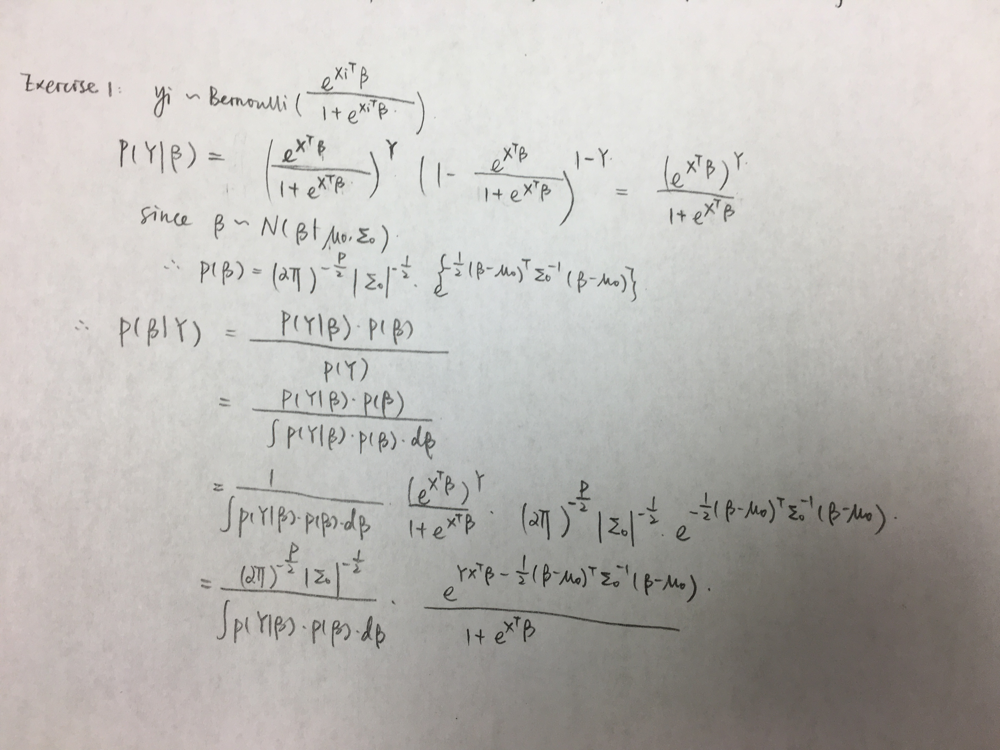

```{r setup, echo = F, message=F, warning=F, include=FALSE}
knitr::opts_chunk$set(echo = TRUE)
require(tidyverse)
require(magrittr)
require(readxl)
require(plyr)
require(ggrepel)
library(cowplot)
require(ggtern)
library(caret)
```

#### Exercise 1: Suppose you specify a normal prior for $\beta$. Try to find the full conditional density function $p(\beta|Y)$. Can you sample from it directly? You don’t need to simplify completely.



#### Exercise 2: What is the sampling density function $p(y_i|\beta_1,…,\beta_k)$ for this model? Write it down.

$$P(y_i=j|\beta) = \prod_{j=1}^{K} \frac{e^{x_{i}^{T}} \beta_{j}}{\sum_{k=1}^{K} e^{x_{i}^{T}} \beta_{k}}^{1[y_i=j]}$$

#### Exercise 3: What is the likelihood function for $y_1$,…,$y_n$? Write it down.

$\begin{align*}
P(y_1, y_2, ..., y_n|\beta) &=  \prod_{i=1}^{n} P(y_i|\beta)\\
                            &=  \prod_{i=1}^{n} \prod_{j=1}^{K} \frac{e^{x_{i}^{T}} \beta_{j}}{\sum_{k=1}^{K} e^{x_{i}^{T}} \beta_{k}}^{1[y_i=j]} \\
                            &= \prod_{j=1}^{K} \frac{e^{x_{i}^{T}} \beta_{j}}{\sum_{k=1}^{K} e^{x_{i}^{T}} \beta_{k}}^{n_j}
\end{align*}$

(where  $n_j$ is the number of individuals in $j$)

## Multiclass logistic regression

```{r}
n_noise_features <- 25
noise_features <- rnorm(n_noise_features*nrow(iris)) %>% 
  matrix(nrow = nrow(iris)) %>% 
  magrittr::set_colnames(paste0("V", 1:n_noise_features)) %>%
  data.frame()
modified_iris <- data.frame(noise_features, iris)
X <- modified_iris[, 1:(ncol(modified_iris)-1)] %>% as.matrix()
y <- as.integer(as.factor(modified_iris[, ncol(modified_iris)]))
```

```{r}
proposal_sd <- 0.05
#
proposal_lpdf <- function(beta, beta0){
  K <- length(beta)
  lpdf <- 0
  for(k in 2:K){
    lpdf <- lpdf + sum(dnorm(beta[[k]], mean = beta0[[k]], sd = proposal_sd, log = T))
  }
  return(lpdf)
}
#
prior_lpdf <- function(beta){
  K <- length(beta)
  lpdf <- 0
  for(k in 2:K){
    lpdf <- lpdf + sum(dnorm(beta[[k]], sd = 0.5, log = T))
  }
  return(lpdf)
}
#
likelihood_lpdf <- function(y, X, beta){
  K <- length(beta)
  lpdf <- 0
  for(k in 1:K){
    lpdf <- lpdf + sum(sapply(which(y == k), function(i){
      sum(X[i, ]*beta[[k]]) - log(sum(sapply(1:K, function(b){
        exp(sum(X[i, ]*beta[[b]]))
      })))
    })
    )
  }
  return(lpdf)
}
```

```{r}
MH <- function(proposal_sd){
  S <- 10000
  burn <- 5000
  beta0 <- list(a = 0, b = rnorm(ncol(X)), c = rnorm(ncol(X)))
  beta_list <- list(a = rep(0, S - burn), 
                    b = matrix(NA, nrow = S - burn, ncol = ncol(X)),
                    c = matrix(NA, nrow = S - burn, ncol = ncol(X)))
  for(s in 1:S){
    #
    beta_star <- list(a = 0,
                      b = rnorm(length(beta0[[2]]), mean = beta0[[2]], sd = proposal_sd),
                      c = rnorm(length(beta0[[3]]), mean = beta0[[3]], sd = proposal_sd))
    #
    r <- exp((likelihood_lpdf(y, X, beta_star) + prior_lpdf(beta_star) + proposal_lpdf(beta0, beta_star)) -
               (likelihood_lpdf(y, X, beta0) + prior_lpdf(beta0) + proposal_lpdf(beta_star, beta0)))
    #
    if(runif(1) < r){
      if(s > burn){
        beta_list[["a"]][s - burn] <- beta_star[["a"]]
        beta_list[["b"]][s - burn, ] <- beta_star[["b"]]
        beta_list[["c"]][s - burn, ] <- beta_star[["c"]]
      }
      beta0 <- beta_star
    } else {
      if(s > burn){
        beta_list[["a"]][s - burn] <- beta0[["a"]]
        beta_list[["b"]][s - burn, ] <- beta0[["b"]]
        beta_list[["c"]][s - burn, ] <- beta0[["c"]]
      }
    }
  }
  return(beta_list)
}
```


```{r}
beta_list = MH(proposal_sd)

## Look at some traceplots
par(mfrow = c(3, 2))
for(j in sample(ncol(beta_list$b), 6)){
  plot(beta_list$b[, j], type = 'l', ylab = paste("Beta", j), xlab = "Iter", col = "purple",
       main = paste("Acceptance ratio =", round(length(unique(beta_list$b[,j])) / nrow(beta_list$b), 3)))
  acf(beta_list$b[, j], ylab = paste("Beta", j), main = paste("Series Beta", j))
}
```


#### Exercise 4: Based on the traceplots, do you think the chain has converged?

The chain doesn't seem to converge because the traceplots don't stablize at all during 5000 iterations. For instance, some traceplots have huge ups and downs and hows cyclic local trends.

#### Exercise 5: Our hope was to have independent samples from the posterior. Is that the case here?
No, autocorrelations in autocorrelation plots remain large at lag 35, which means samples have high correlation. Also the autocorrelations don't seem to decrease a lot as lag k increases.

#### Play around with a few values of δ. Pick a δ value that gets the acceptance ratios somewhere between 0.40 and 0.45. Make new traceplots and autocorrelation plots for your new δ value.
```{r}
## the following code explore a few values of sigma, however I commented them out since they took too long to run. I foun that 0.03 satisfy the condition.

# proposal_sds = c(0.01, 0.02, 0.03, 0.04)
# desired_sds = c()
# for (proposal_sd in proposal_sds){
#   beta_list = MH(proposal_sd)
#   acceptance = length(unique(beta_list$b[,1])) / nrow(beta_list$b)
#   desired_sds = c(desired_sds,acceptance)
# }

beta_list2 = MH(0.03)
## Look at some traceplots
par(mfrow = c(3, 2))
for(j in sample(ncol(beta_list2$b), 6)){
  plot(beta_list2$b[, j], type = 'l', ylab = paste("Beta", j), xlab = "Iter", col = "purple",
       main = paste("Acceptance ratio =", round(length(unique(beta_list2$b[,j])) / nrow(beta_list2$b), 3)))
  acf(beta_list2$b[, j], ylab = paste("Beta", j), main = paste("Series Beta", j))
}
```

#### Exercise 6: Based on the new traceplots, do you think the chain has converged?
No, the chain hasn't converged. The snaking behavior in traceplots are very serious.

#### Exercise 7: What can you say about independence?
We don't have independent samples from the posterior since the autocorrelation looks exactly the same as when proposal std is 0.05. Autocorrelations remain huge after 35 lags.

```{r}
## thinning
thin_seq <- seq(1, nrow(beta_list$b), by = 10)
par(mfrow = c(3, 2))
for(j in sample(ncol(beta_list$b), 6)){
  plot(beta_list$b[thin_seq, j], type = 'l', ylab = paste("Beta", j), xlab = "Iter", col = "purple",
       main = paste("Acceptance ratio =", round(length(unique(beta_list$b[thin_seq,j])) / nrow(beta_list$b[thin_seq, ]), 3)))
  acf(beta_list$b[thin_seq, j], ylab = paste("Beta", j), main = paste("Series Beta", j))
}
```

#### Exercise 8:Based on the new traceplots, do you think the chain has converged?
The chain looks better when thinning but still hasn't converged yet. Since traceplots still don't seem to stabilize during 500 iterations (still ups and downs).

#### Exercise 9: What can you say about independence here?
We can see from the autocorrelation plots that the autocorrleations are decresaing as lag k increases instead of remaining almost the same, but still we don't have truly independent samples from the posterior since there is still autocorrelations after lag 25.

```{r}
## posterior distribution for each coefficient
((-beta_list$b[thin_seq, ] - beta_list$c[thin_seq, ])/2) %>%
  reshape2::melt() %>%
  dplyr::mutate(cat = "1") %>%
  rbind(reshape2::melt(beta_list$b[thin_seq, ] + ((-beta_list$b[thin_seq, ] - beta_list$c[thin_seq, ])/2)) %>% dplyr::mutate(cat = "2")) %>%
  rbind(reshape2::melt(beta_list$c[thin_seq, ] + ((-beta_list$b[thin_seq, ] - beta_list$c[thin_seq, ])/2)) %>% dplyr::mutate(cat = "3")) %>%
  ggplot2::ggplot() +
  geom_boxplot(aes(x = as.factor(Var2), y = value, fill = cat))  +
  scale_fill_brewer(palette = "Set1", name = "Species", labels = c("Setosa", "Versicolor", "Virginica")) +
  labs(x = "Coefficient", y = expression(beta))

## How well does our model fit the data?
denom <- (1 + exp(X%*%t(beta_list$b[thin_seq, ])) + exp(X%*%t(beta_list$c[thin_seq, ])))
mod_preds <- data.frame(setosa = rowMeans(1 / denom),
                        versicolor = rowMeans(exp(X%*%t(beta_list$b[thin_seq, ])) / denom),
                        virginica = rowMeans(exp(X%*%t(beta_list$c[thin_seq, ])) / denom))

predicted_species <- apply(mod_preds,1,function(x) unique(modified_iris$Species)[which(x==max(x))])
Conf_mat <- confusionMatrix(predicted_species,modified_iris$Species)
Conf_mat$table
Conf_mat$overall["Accuracy"]
Conf_mat$byClass[,c("Sensitivity","Specificity")]
```


## Laplace Prior
```{r}
data.frame(sigma = rep(c(1, 2, 4), each = 1000)) %>%
  dplyr::group_by(sigma) %>%
  dplyr::mutate(x = seq(-10, 10, length.out = 1000),
                dens = (1/(2*sigma))*exp(-abs(seq(-10, 10, length.out = 1000))/sigma)) %>%
  dplyr::ungroup() %>%
  ggplot2::ggplot() +
  geom_line(aes(x = x, y = dens, colour = as.factor(sigma), group = as.factor(sigma))) +
  scale_colour_manual(values = c("#74a9cf", "#0570b0", "#023858"), name = expression(sigma))
```


```{r}
# new prior_lpdf
prior_lpdf <- function(beta){
  K <- length(beta)
  lpdf <- 0
  b <- 0.5 / sqrt(2)
  for(k in 2:K){
    lpdf <- lpdf + sum(-abs(beta[[k]])/b - log(2*b))
  }
  return(lpdf)
}

beta_list = MH(0.05)

((-beta_list$b[thin_seq, ] - beta_list$c[thin_seq, ])/2) %>%
  reshape2::melt() %>%
  dplyr::mutate(cat = "1") %>%
  rbind(reshape2::melt(beta_list$b[thin_seq, ] + ((-beta_list$b[thin_seq, ] - beta_list$c[thin_seq, ])/2)) %>% dplyr::mutate(cat = "2")) %>%
  rbind(reshape2::melt(beta_list$c[thin_seq, ] + ((-beta_list$b[thin_seq, ] - beta_list$c[thin_seq, ])/2)) %>% dplyr::mutate(cat = "3")) %>%
  ggplot2::ggplot() +
  geom_boxplot(aes(x = as.factor(Var2), y = value, fill = cat))  +
  scale_fill_brewer(palette = "Set1", name = "Species", labels = c("Setosa", "Versicolor", "Virginica")) +
  labs(x = "Coefficient", y = expression(beta))
```

#### Exercise 10: Compute the accuracy for the new model. How does our inference under the Laplace prior compare to that under the Gaussian prior?

```{r}
denom <- (1 + exp(X%*%t(beta_list$b[thin_seq, ])) + exp(X%*%t(beta_list$c[thin_seq, ])))
mod_preds <- data.frame(setosa = rowMeans(1 / denom),
                        versicolor = rowMeans(exp(X%*%t(beta_list$b[thin_seq, ])) / denom),
                        virginica = rowMeans(exp(X%*%t(beta_list$c[thin_seq, ])) / denom))

predicted_species <- apply(mod_preds,1,function(x) unique(modified_iris$Species)[which(x==max(x))])
Conf_mat2 <- confusionMatrix(predicted_species,modified_iris$Species)
Conf_mat2$table
Conf_mat2$overall["Accuracy"]
Conf_mat2$byClass[,c("Sensitivity","Specificity")]
```

The accuracy increases from about 93% to 97%. In addition, sensitivity and specificity of 'versicolor' class also improves.